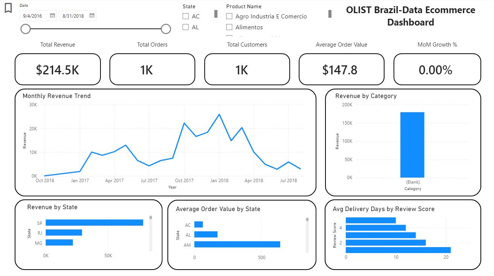

# Brazil E-Commerce Sales Analysis Project

## Project Overview

This project analyzes the Olist Brazilian E-Commerce dataset to evaluate sales performance, customer behavior, product performance, delivery efficiency, and customer satisfaction.

Tools Used:
- SQL Server
- Power BI
- Power Query

---

## Business Problem

The business required a centralized dashboard to monitor sales performance, customer activity, regional performance, delivery times, and customer satisfaction.

---

## Dashboard Preview



---

## Key KPIs

| KPI | Value |
|------|---------|
| Total Revenue | $16.0M |
| Total Orders | 99,441 |
| Total Customers | 96,096 |
| Average Order Value | $160.99 |
| Average Review Score | 4.1 |
| Average Delivery Time | 12.4 Days |

---

## Key Insights

### 1. São Paulo Drives Revenue

São Paulo generated 37% of total company revenue.

### 2. Acre Has High-Value Customers

Acre ranked second in average order value despite low overall revenue.

### 3. Delivery Speed Impacts Reviews

Longer delivery times were associated with lower review scores.

## Recommendations

### 1. Prioritize São Paulo for customer retention and logistics optimization because it is 
the company’s largest revenue market.  
### 2. Investigate Acre further to determine whether targeted marketing could increase 
order volume while maintaining its high average order value. 
### 3. Protect and expand the top-performing product categories but monitor dependency 
risk by identifying emerging categories with growth potential.  
### 4. Improve delivery speed and reliability, especially for orders at risk of long delivery 
times, because delayed deliveries appear linked to lower review scores.  
### 5. Analyze one-star reviews in more detail to identify recurring complaints related to 
delivery, product quality, or customer service.

---

## SQL Analysis

Example:

```sql
WITH TotalRevenue AS ( 
 SELECT 
 FORMAT(o.order_purchase_timestamp , 'yyyy-MM') AS OrderMonth , 
 SUM(op.payment_value ) AS revenue 
FROM order_payments op 
JOIN orders o 
 ON op.order_id = o.order_id 
GROUP BY  
 FORMAT(o.order_purchase_timestamp , 'yyyy-MM') 
) 
 
SELECT  
 OrderMonth , 
 revenue , 
 ROUND ( 
 (revenue - LAG(revenue ) OVER (ORDER BY OrderMonth )) 
 * 100 / 
 LAG(revenue ) OVER (ORDER BY OrderMonth ), 
 2 
 )AS PercentageChange  
FROM TotalRevenue 
ORDER BY OrderMonth 
